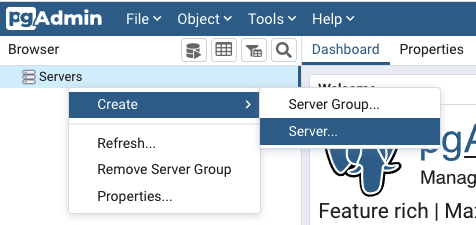
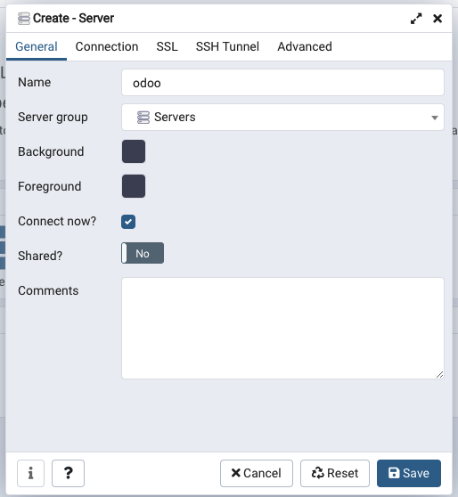
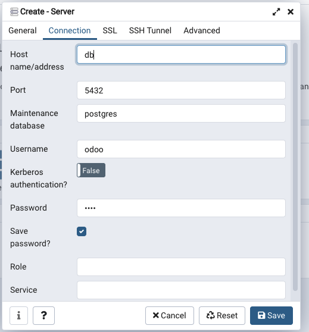
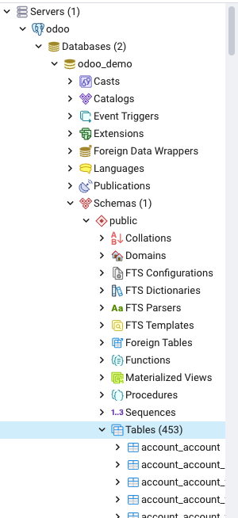

# Odoo + pgAdmin | Developer Environment with Docker

## Objective

Developing more fun and easy addons in Odoo using Docker.

## Table of contents

- [Requirements](#requirements)
- [How start](#how-start)
- [How to connect the database with pgAdmin](#how-to-connect-the-database-with-pgadmin)
- [Commands](#commands)

## Requirements

You need to have:

- A Mac or a Linux to run commands in *bash*

- Docker installed in your computer. If you don't have Docker. You can get it [here](https://docs.docker.com/get-docker/).

## How start

1 - Execute the command `bin/start` to download Odoo, Postgres and pgAdmin.

2 - When done, you will be able to access:

- **Odoo**: http://localhost:8069/
- **pgAdmin**: http://localhost:5050

**NOTE**: It's possible that at first it will not go because it's still loading

3 - When you want to stop the server. You can run `bin stop`

## How to connect the database with pgAdmin

1 - Go to http://localhost:5050 in your favourite browser.

2 - Login with credentials (You can changes in the [docker-compose.yml](docker-compose.yml) file)

- **Email**: postgres@localhost.com
- **Password**: postgres

3 - Inside the Browser, click Servers -> Create -> Server...

4 - Add a name in General

5 - Change in Connection:

- **Host name / address**: db
- **Port**: 5432
- **Maintenance database**: postgres
- **Username**: odoo
- **Password**: odoo

6 - If you save the configuration, you can see all Odoo databases that you've created

- **Host name / address**: db
- **Port**: 5432
- **Maintenance database**: postgres
- **Username**: odoo
- **Password**: odoo

## Commands

- `bin/bash`: Access Bash.

- `bin/remove`: Remove all containers.

- `bin/removeall`: Remove all containers, networks, volumes, and images.

- `bin/removevolumes`: Remove all volumes.

- `bin/restart`: Restart all containers.

- `bin/scaffold`: Create an addon template. You must pass the module name in parameter and an optional directory where save the addon.

- `bin/start`: Start all containers.

- `bin/status`: Check the container status.

- `bin/stop`: Stop all containers.

- `bin/updateaddon`: Update an addon. You must pass two parameters using `-d database_name` to assign the database name, and `-u addon_name` to assign the addon name.

